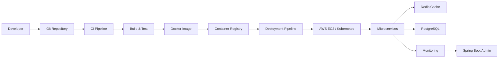

<h1 align="center">Hi 👋, I'm Sastik Kumar Das</h1>
<h3 align="center">Software Engineer | Backend & DevOps | Microservices Architect</h3>

---

# 👨‍💻 About Me

🚀 Software Engineer focused on **Backend Systems, DevOps Automation, and Distributed Architecture**

🏢 Currently working at **TCS**

⚡ Passionate about:

• Microservices Architecture  
• CI/CD Automation  
• Cloud Infrastructure  
• System Design  
• Developer Productivity Tools  

🌍 Founder Member of **CITADEL Foundation** mentoring students in programming and cybersecurity.

---

# 🧠 DevOps Architecture

# 💻 Tech Stack

### Programming

### Backend

### DevOps

### Databases

---

# 🚀 Projects

## Multi-Tenant Workflow Automation Platform

FastAPI • AWS • Jenkins

• SaaS-grade workflow automation platform  
• JWT authentication + RBAC authorization  
• CI/CD deployment with Jenkins  

---

## Deployment Workflow & Release Management

FastAPI • React • PostgreSQL

• Role-based deployment system  
• SIT, UAT, PreProd, Production support  
• Redis caching for performance
# 📊 GitHub Stats

---

# 📈 Activity Graph

---

# 🐍 Contribution Snake

---

# 📫 Connect With Me

---

⚡ Engineering scalable systems for the future

